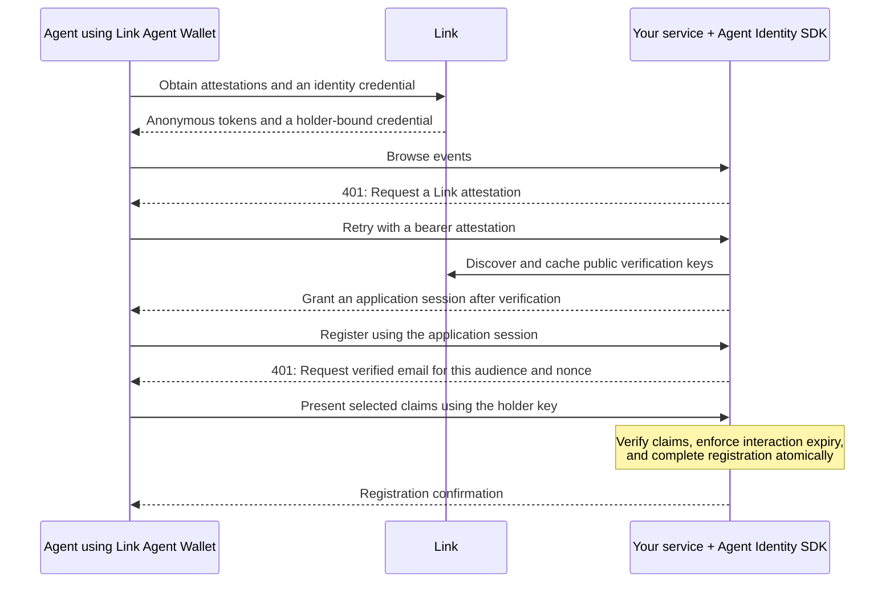

# @stripe/agent-identity

Agent Identity is the service-side verification SDK for [Link Agent Wallet](https://github.com/stripe/link-cli#identity-experimental). Agents use the wallet to obtain Link credentials and present them to websites and APIs. Your service uses `@stripe/agent-identity` to check those credentials and decide what access to allow.

An agent booking an event might need access to the event list before it needs to share an email. An anonymous Link attestation can satisfy the first check. A separate identity presentation can disclose a verified email for registration. Your service chooses when each check is needed and what a successful result permits.

| Your service needs | What to verify |
| --- | --- |
| Proof from Link without personal details | A bearer Agent Attestation Token (AAT), built on Privacy Pass. It proves Link issuance without identifying the person or agent presenting it. |
| An email or another supported personal detail | A selectively disclosed identity presentation (SD-JWT-VC), signed by Link and the credential holder. For verified email, require `email` and `email_verified` and check that `email_verified === true`. |

The SDK uses Link's public metadata and verification keys. It needs neither the agent's Link access token nor a Stripe secret key. Link is the supported issuer. The wallet commands remain **Unlisted** and require `LINK_IDENTITY_COMMANDS=1`; live issuance also requires access on the Link account.

## Scope

- Build a `401` challenge asking for a Link bearer AAT.
- Verify the AAT's structure, issuer key, stable challenge digest, and blind-RSA authenticator.
- Build a `401` challenge asking for supported identity claims.
- Verify an SD-JWT-VC presentation, including issuer signature, disclosures, credential expiry, holder-signed Key Binding JWT, audience, and expected nonce equality.

Link is the default trust anchor. `issuerOptions.issuer` exists for staging and tests; using another provider is unsupported. Token issuance, risk scoring, issuer-mediated claims, and application authorization are outside this package's scope.

## Build and install from source

The new package name is not published to npm. In a checkout of this repository, use Node 24+ and pnpm to build it:

```sh
pnpm install --frozen-lockfile
pnpm --filter @stripe/agent-identity build
node packages/agent-identity/example/verify.mjs
node packages/agent-identity/example/step-up/demo.mjs
```

To use it in a separate application, pack the package and install the resulting archive:

```sh
cd packages/agent-identity
pnpm pack
# From your application directory, using the path to your checkout:
npm install /path/to/link-cli/packages/agent-identity/stripe-agent-identity-0.2.0.tgz
```

The built package supports Node 22+, ESM and CommonJS. It uses Node’s built-in byte and cryptography APIs and `jose` for JWS verification, JWK import, and key thumbprints. Runtimes without the required Node APIs are unsupported. Licensed under the [MIT license](LICENSE).

- [Examples](example/README.md): local credential verification and an HTTP event-registration flow with a wallet client.
- [MCP integration](example/mcp/README.md): HTTP challenges, client retries, and application access policy.
- [Integration tests](test/README.md): fixtures, failure cases, clocks, and application replay tests.
- [Agent instructions](AGENTS.md): concise integration guidance for coding agents.

## How it works



The [step-up example](example/step-up/README.md) implements this flow, including session isolation and retry recovery. Identity checks and payment authorization are separate; if your service also uses HTTP `402` payments, verify payment credentials through that integration.

## Quickstart

Create one verifier per process so requests share its issuer key cache. `origin` sets the audience for identity claims. It does not restrict where a bearer AAT can be presented.

```ts
import { LinkVerifier, isRejection } from '@stripe/agent-identity';

const verifier = new LinkVerifier({ origin: 'https://shop.example' });

export async function handle(request: Request): Promise<Response> {
  const result = await verifier.verifyAttestation(request.headers.get('Authorization'));
  if (!result.valid) {
    const failure = result.failures[0]!;
    if (!isRejection(failure)) {
      return Response.json({ code: failure.code }, { status: 503 });
    }
    try {
      const challenge = await verifier.attestationChallenge();
      const headers = new Headers();
      for (const value of challenge.wwwAuthenticate) {
        headers.append('WWW-Authenticate', value);
      }
      return Response.json({ code: failure.code, message: failure.message }, { status: 401, headers });
    } catch {
      return Response.json({ code: 'issuer_unavailable' }, { status: 503 });
    }
  }

  // Token verification leaves the request body untouched.
  // Apply your application's authorization policy before performing an action.
  return Response.json({ tokenValid: true, issuer: result.issuer });
}
```

Successful verification does not create a session. Your application can use the result to authorize the current operation or establish/update an application session. The SDK does not issue session credentials or manage session permissions, expiry, or revocation. Retaining an attestation result records that a Link-issued bearer token was accepted; it does not identify the presenter or grant application permissions.

The verification calls take credential field values, including the `PrivateToken` scheme for attestations. `null`, `undefined`, and empty strings return `incomplete_protocol_request`. Combined attestation credentials and repeated `token` parameters are rejected. Reject duplicate credential fields before passing values from a framework that discards duplicates. For Node or Express, use `req.headersDistinct`:

```ts
const values = req.headersDistinct.authorization;
if (values !== undefined && values.length !== 1) {
  return res.status(400).json({ code: 'malformed_protocol_input' });
}
const result = await verifier.verifyAttestation(values?.[0]);
```

No request adapter or raw body reader is required. Keep your framework's body parsing and size limits. Serve credential-bearing endpoints over HTTPS; the SDK receives strings and cannot enforce transport security.

## Attestations

```ts
const challenge = await verifier.attestationChallenge();
for (const value of challenge.wwwAuthenticate) {
  res.appendHeader('WWW-Authenticate', value);
}
res.status(401).end();
```

Link's advertised keys each get a challenge, all with the same stable TokenChallenge: Link's issuer name, empty `origin_info`, and empty `redemption_context`. This lets an agent answer from a pre-provisioned pool. Send separate `WWW-Authenticate` fields where the framework supports it.

Return the actual HTTP `401` and challenge headers from the protected endpoint. A connection action can request that endpoint directly; the SDK does not require a login page or token-entry form. The agent or its companion client supplies a bearer AAT in `Authorization` when retrying. For MCP, perform this check before JSON-RPC dispatch rather than returning an authentication error inside a successful HTTP tool response.

```ts
const result = await verifier.verifyAttestation(authorization);
if (result.valid) {
  result.issuer;
  result.tokenKeyId;
  result.bindingMode; // always 'bearer'
}
```

Key-bound AATs are rejected with `challenge_mismatch`. Their redemption context depends on an agent key, and this SDK does not establish possession of that key. The verifier never accepts an externally supplied thumbprint as proof of possession.

For lower-level composition, `verifyAttestation(authorization, { issuer })` takes an existing `LinkIssuer`. `parsePrivateTokenCredential`, `parseToken`, `challengeDigestMatches`, and `verifyTokenSignature` are exported. Calling `verifyTokenSignature` alone only checks the authenticator; use the complete verifier to enforce issuer trust and the supported challenge profile.

## Identity claims

Your application can request identity claims directly without first requiring an attestation. Each check has its own verification API and access policy.

Start with the runnable [credential verification example](example/verify.mjs) for a fixture-based verified-email check, or the [event-registration example](example/step-up/README.md) for a complete HTTP service. The excerpts below assume an existing handler and application-owned interaction store; `interactions` and `interactionId` are placeholders for that application code.

```ts
const challenge = await verifier.claimsChallenge({
  claims: ['email', 'email_verified'],
  purpose: 'Register for an event',
});
// Application-owned interaction store, scoped to this caller and operation.
await interactions.save(interactionId, {
  nonce: challenge.nonce,
  expiresAt: challenge.expiresAt,
  requiredClaims: ['email', 'email_verified'],
});
res.setHeader('WWW-Authenticate', challenge.wwwAuthenticate);
res.setHeader('Content-Type', 'application/problem+json');
res.status(401).json(challenge.body);
```

Your application must associate the nonce and `expiresAt` value with the correct interaction, enforce any expiration or single-use policy, and pass the expected nonce back at verification. The SDK does not persist nonce state. Requesting claims that Link does not advertise throws. Use `claimsSupported()` to inspect current metadata.

The SDK's `challenge.body` contains the fields below. Send it with HTTP `401`, `WWW-Authenticate: Identity-Presentation`, and `Content-Type: application/problem+json`:

```json
{
  "type": "urn:stripe:link:claims-required",
  "aud": "https://shop.example",
  "nonce": "<generated nonce>",
  "claims": ["email", "email_verified"],
  "purpose": "Register for an event",
  "formats": ["dc+sd-jwt"],
  "trusted_issuers": ["https://api.link.com"]
}
```

`purpose` is optional. The SDK returns `expiresAt` separately, in Unix seconds. The event-registration example adds `expires_at` and `interaction_id` to its response body and accepts the interaction ID in `X-Registration-Interaction` on retry. Those fields and that header are application conventions; they are not part of the SDK's challenge body.

If your application has no session, create an opaque interaction ID and store the challenge, expiry, and intended operation on the server. Have the client echo that ID on retry, validate the operation and caller context against the stored record, and pass the stored nonce to `verifyClaims`. Do not derive the expected nonce from the unverified presentation. If your policy requires single use, atomically mark the application interaction complete before authorizing the operation. Share this state across replicas. See the [MCP guide](example/mcp/README.md#associate-the-nonce-with-an-operation) for interaction state and bearer continuation policies.

```ts
const result = await verifier.verifyClaims(request.headers.get('Identity-Presentation'), {
  nonce: nonceFromSession,
  requiredClaims: ['email', 'email_verified'],
});
if (result.valid) {
  result.claims; // only the disclosed claims; check their types and business rules
  // For this policy, accept only a string email with email_verified === true.
  result.holderKeyThumbprint; // the credential's cnf.jwk
}
```

`requiredClaims` is explicit; write `[]` to require none. Verification does not mutate nonce or interaction state on success or failure. The same valid presentation can verify again when the caller supplies the same expected nonce. Applications that require replay prevention must enforce it in their own stack.

Decide whether successful verification permits one operation, one resource, or an application session. Subsequent requests can authenticate using your application's session credential; they do not need another identity presentation unless your policy requires one. Retain the verified disclosed claims with that session if needed, and make a separate decision about the permissions they grant. The [event-registration example](example/step-up/README.md#what-happens) demonstrates a session with a separate disclosure for each registration.

Reject expired or completed interactions according to your policy before authorizing an operation, and recheck after asynchronous verification before completing it. Bound pending records and coordinate interaction completion, side effects, and idempotency. Invalid or incomplete presentations can leave an unexpired interaction pending so the caller can correct them.

The holder-signed Key Binding JWT is required. It binds the disclosure to the expected audience and nonce and protects the selected disclosures with `sd_hash`. It does not bind the presentation to the HTTP request or establish that a separately presented anonymous AAT belongs to the same holder.

The credential must carry `exp`; there is no skew allowance past credential expiry. Nested selective disclosure, array-element disclosure, and reserved claim names are rejected explicitly. For lower-level composition, use `verifyClaimsPresentation` with an explicit issuer, audience, nonce, and required claims.

## MCP client challenge handling

Link's `PrivateToken` and `Identity-Presentation` challenges are a custom exchange over MCP's HTTP transport, outside MCP's standard OAuth authorization flow. They require an explicitly integrated client or companion. The MCP TypeScript client's OAuth support does not answer them and can start OAuth discovery on a `401` unless your handler intercepts it. Integrate credential handling at the HTTP transport layer: preserve the challenge, validate the identity audience and association with the pending operation, obtain disclosure permission, and retry with the required credentials and your application's interaction identifier. Preserve MCP headers and successful response streams, restrict credentials to the intended endpoint, and bound retries. Credential issuance and disclosure permission belong to the caller; they are not SDK APIs. See the [MCP guide](example/mcp/README.md) for MCP version compatibility and the server and client requirements.

## Results and errors

Inspect `result.valid`, because the result object itself is truthy on failure. `verifyAttestationOrThrow` and `verifyClaimsOrThrow` instead throw `VerificationError` with the same failure codes. The low-level throwing variants are also exported.

| Code | Meaning | Check |
| --- | --- | --- |
| `incomplete_protocol_request` | Credential is missing or empty. | Read the correct header and issue a challenge. |
| `malformed_protocol_input` | Credential cannot be parsed. | Pass a single header string, including the attestation scheme. Reject duplicates. |
| `invalid_private_token` | AAT authenticator is invalid. | Confirm the token is intact and was issued by Link. |
| `challenge_mismatch` | Token does not match the supported bearer challenge. | Use a bearer AAT. Key-bound AATs are unsupported. |
| `unknown_issuer` | The token key is not accepted from Link. | Check issuer configuration and key retirement. |
| `invalid_claims_presentation` | A claims presentation failed verification. | Inspect audience, expected nonce, required disclosures, signatures, and expiry. |
| `issuer_unavailable` | Issuer metadata or keys could not be read. | Check connectivity and deadlines. Return `503`. |

`FAILURE_CODES` exports the full list. `isRejection(failure)` distinguishes credential rejections, typically HTTP 401, from issuer availability failures, typically HTTP 503. Challenge builders and `warm()` throw on failure; handle these failures in your application. Warming is optional and should not prevent startup unless that is your application's intended policy.

Attestation rejection messages include a link to the [Link Agent Wallet](https://github.com/stripe/link-cli) and instructions to obtain a bearer AAT and retry. Return `failure.message` alongside the error code and `WWW-Authenticate` challenge so agents can act on that guidance. `VerificationError.message` includes the same guidance for attestation rejections. Issuer availability errors and identity-presentation errors do not include this AAT recovery guidance.

## API reference

Import `LinkVerifier` from `@stripe/agent-identity`. All methods below are asynchronous. Verification results are discriminated by `valid`; challenge builders and metadata methods throw on failure.

| Method | Input | Result |
| --- | --- | --- |
| `attestationChallenge(options?)` | Optional `maxAgeSeconds`, default `300`; this does not expire tokens | `wwwAuthenticate: string[]` and `challengeDigest` |
| `verifyAttestation(authorization)` | Complete header value, or `null`/`undefined` | On success: `issuer`, `tokenKeyId`, `bindingMode: 'bearer'`; on failure: `failures` |
| `verifyAttestationOrThrow(authorization)` | Same as above | Successful result or `VerificationError` |
| `claimsChallenge(options)` | Nonempty `claims`, optional `purpose`, optional `nonceTtlSeconds` (default `300`) | `wwwAuthenticate`, problem `body`, `nonce`, `expiresAt` in Unix seconds |
| `verifyClaims(presentation, options)` | Header value; expected `nonce` and explicit `requiredClaims` | On success: `issuer`, disclosed `claims`, `holderKeyThumbprint`, `vct`; on failure: `failures` |
| `verifyClaimsOrThrow(presentation, options)` | Same as above | Successful result or `VerificationError` |
| `claimsSupported()` | None | Claim names advertised by Link |
| `warm()` | None | Refresh issuer key cache; optional |

The constructor requires `origin`. `timeoutMs` defaults to `3000`; `fetchImpl` defaults to Fetch; `now` returns Unix seconds. `issuerOptions` configures issuer discovery and token key acceptance, with issuer overrides for staging and tests.

Lower-level exports include `LinkIssuer`, `verifyAttestation`, `verifyAttestationOrThrow`, `createAttestationChallenge`, `createClaimsChallenge`, `verifyClaimsPresentation`, `verifyClaimsPresentationOrThrow`, `parsePrivateTokenCredential`, `parseToken`, `encodeTokenChallenge`, `challengeDigestMatches`, and `verifyTokenSignature`. Individual parsing or signature helpers do not perform complete verification. `clearJwksCache`, `FAILURE_CODES`, `isRejection`, and `VerificationError` support testing and error handling. Types are exported from the same entry point.

## Configuration and operations

`LinkVerifier` requires `origin`, supplied from configuration as a host, host:port, or full HTTP(S) origin. Bare authorities default to HTTPS; an explicit scheme is preserved, including `http://localhost:3000` for local integration tests. It sets the claims audience. Use trusted configuration, not an unvalidated incoming `Host` or forwarding header. Optional settings are `timeoutMs` (default 3000), `fetchImpl`, `now`, and `issuerOptions`.

Reuse one instance per process to share issuer caches. The SDK has no replay or double-spend store for AATs or identity presentations. Applications own nonce association, expiration, atomic consumption, and replay policy in infrastructure appropriate to their deployment.

Token keys are revalidated according to `issuerOptions.maxKeyAgeSeconds` (default 900). When Link rotates, existing tokens stop verifying after the verifier observes that their key was retired, unless old and new keys overlap or `retiredKeyGraceSeconds` is configured. A grace period means continuing to accept a key Link no longer advertises. Issuer fetches enforce bounded responses, deadlines, same-origin validation, and refresh throttling.

Credential signing keys are cached process-wide for one hour by JWKS URI. `clearJwksCache()` is exported for tests; the token key cache settings do not control this cache. There are no built-in metrics or logging hooks. Instrument verification results at the call site without logging tokens, presentations, or disclosed personal information.

## Limitations

Credential parsing is bounded: `Authorization` values may contain up to 8,192 characters and identity presentations up to 65,536 characters. Larger values return verification failures before parsing or issuer requests. Keep your HTTP server’s header limits enabled; those may be smaller.

**AAT single use is not enforced.** Anyone holding a valid bearer token can present it again, including to another service. There is no request-signature time window or per-token expiry check. A token remains verifiable while its signing key is trusted. Challenge `max-age` does not bound token lifetime because the challenge is stable.

AAT double-spend detection and replay prevention belong to adopters. The SDK does not provide a spent-token store or enforcement. If your service requires AAT single use, implement and operate that policy in your own stack.

**Identity-presentation replay is not enforced.** The SDK checks that the holder-signed nonce equals the expected nonce supplied by the caller. It does not record, expire, or consume that nonce. If your service requires a presentation to succeed only once, implement that policy atomically in your own stack.

**Credential validity is not request authorization.** Decide which operations a presented credential permits and how it attaches to a session or interaction. The SDK does not supply an agent identity, authenticate an HTTP body, or establish that two credentials were presented by their original holder.

## Testing your integration

The fixtures use real cryptography and can produce deliberately invalid inputs. A redeemed AAT's authenticator is a normal RSA-PSS signature over the token input; `LinkFixture` signs directly because blinding and unblinding cancel out before redemption. These tests do not exercise issuance blinding.

```ts
import assert from 'node:assert/strict';
import { test } from 'vitest';
import { LinkVerifier } from '@stripe/agent-identity';
import { LinkFixture } from '@stripe/agent-identity/testing';

test('accepts a Link token and rejects a forged token without WBA', async () => {
  const link = await LinkFixture.create();
  const verifier = new LinkVerifier({
    origin: 'shop.example',
    fetchImpl: link.fetchImpl(),
  });

  const token = await link.mint();
  assert.equal(
    (await verifier.verifyAttestation(token.authorization)).valid,
    true,
  );

  const forged = await link.mint({ corruptAuthenticator: true });
  const result = await verifier.verifyAttestation(forged.authorization);
  assert.equal(result.valid, false);
  if (!result.valid)
    assert.equal(result.failures[0]?.code, 'invalid_private_token');
});
```

For identity claims, use `CredentialFixture.present()` and `combineFetch` to serve both Link metadata and credential JWKS. Call `clearJwksCache()` between tests that create new keys for the same issuer. The token challenge encoder and issuer-name derivation are shared by the fixtures and verifier, so the suite also keeps Link's real token key and independent RFC 7638 thumbprint vectors.

## Troubleshooting

- For rejected presentations, check the exact audience, the nonce saved for this interaction, required disclosures, credential expiry, and fresh holder signing time. `http://localhost:3000` and `https://localhost:3000` are different audiences.
- For fixture tests that pass alone but fail together, clear the process-wide JWKS cache between different keys at the same issuer URL. Avoid running those fixture sets concurrently in the same process.
- Some malformed tokens require issuer discovery before evaluation. If discovery fails, preserve `issuer_unavailable` and return `503` rather than converting every failure to `401`.
- A presentation accepted twice is expected at the SDK level. Test single-use requirements against your application's interaction store.

## Development

From `packages/agent-identity`, after installing workspace dependencies:

```sh
pnpm build
pnpm typecheck
pnpm test
```

`pnpm test` runs the library tests with Vitest. Tests live alongside the source in `src/**/__tests__` and use `@/` imports, matching the wallet SDK. `typecheck` checks source and tests, then checks the library separately for declaration generation. Tests and test helpers are excluded from builds and the published package.

Workspace `build`, `typecheck`, and `test` include this package. CI also runs the HTTP example tests, checks documentation references and links, and installs a packed archive into an isolated consumer to check ESM/CommonJS imports and both fixture examples. Run these checks locally after building:

```sh
node --test example/step-up/server.test.mjs
node scripts/check-docs.mjs
node scripts/check-package.mjs
```

CI also exercises the built package on Node 22.

The separate wallet integration test runs the built Link Agent Wallet through JSON issuance, private storage, `pop`, and `present`, and runs the event-registration client against the example service. It uses synthetic credentials and a local issuer with real signatures. Wallet storage is isolated in a temporary directory, and issuer requests cannot reach Link. Run it on macOS or Linux with Node 24+ after the checks above:

```sh
pnpm --filter @stripe/link-sdk build
pnpm --filter=./../cli build
node --test test/wallet.test.mjs
```

CI runs this test after building the wallet and verifier. It stays separate from SDK-only tests so verifier consumers do not need the wallet.
